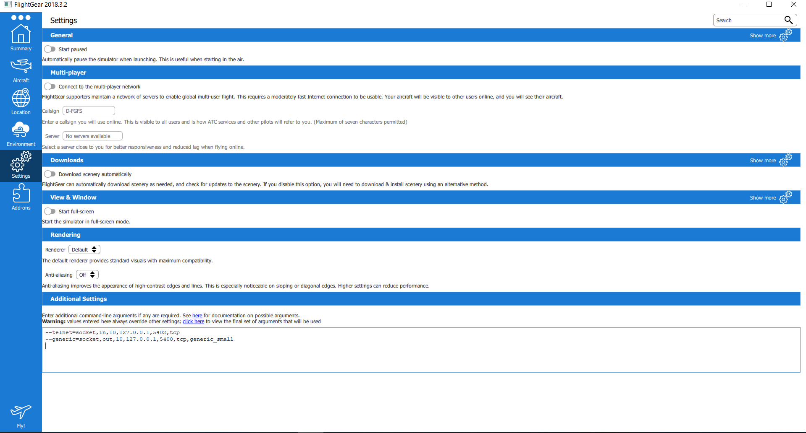

# FlightGear-Simulator-Interpreter
An Interpreter project for a FlightGear flight simulator.
The program connects to the simulator and flys the aircraft based on the user's commands.

## Prerequisites
* Linux environment to run the code

## Installing
* Download and install the simulator on your computer - [https://www.flightgear.org/download/]
* Add the generic_small.xml file to the /data/Protocol directory where you installed the simulator
* Config the following settings in the 'Settings' tab in the simulator:
```
--telnet=socket,in,10,127.0.0.1,5402,tcp
--generic=socket,out,10,127.0.0.1,5400,tcp,generic_small
```


This will open two communication sockets - 'in' where you send commands to the simulator, and 'out' where you receive data from it.

## Running
a. Exceute the code using the terminal or any c++ work environment. The program will wait for a connection from the simulator.

b. Click the 'Fly!' icon in the simulator and wait for the simulator to load. It will connect to the interpreter in the meantime.

The code is designed to read lines of commands entered in a terminal from the user once the program has started running. 
The commands can be entered one at a time or by using a pre-made script (make sure each command starts in a new line).

1. First, enter the following commands to open a local communication server to the simulator and connect to it:
```
openDataServer 5400 10
connect 127.0.0.1 5402
```
2. Initialize your variables:
```
var breaks = bind "/controls/flight/speedbrake"
var throttle = bind "/controls/engines/engine/throttle"
var heading = bind "/instrumentation/heading-indicator/offset-deg"
var airspeed = bind "/instrumentation/airspeed-indicator/indicated-speed-kt"
var roll = bind "/instrumentation/attitude-indicator/indicated-roll-deg"
var pitch = bind "/instrumentation/attitude-indicator/internal-pitch-deg"
var rudder = bind "/controls/flight/rudder"
var aileron = bind "/controls/flight/aileron"
var elevator = bind "/controls/flight/elevator"
var alt = bind "/instrumentation/altimeter/indicated-altitude-ft"
```
3. Exceute your commands:
```
breaks = 0
throttle = 1
var h0 = heading
while alt < 1000 {
    rudder = (h0 – heading)/20
    aileron = - roll / 70
    elevator = pitch / 50
    print alt
    sleep 250
}
print "done"
```
The program reads the code, parses it and sends the commands to the simulator,When the program reads the keyword "done", it will stop sending commands to the simulator, terminating the communication with it and ending the program.
